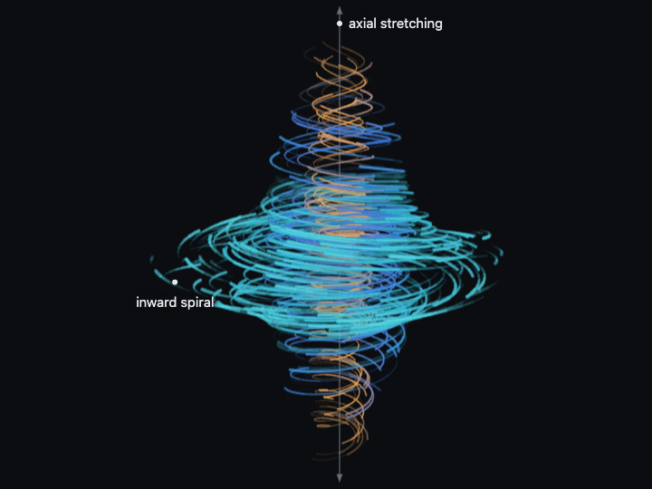

# The Navier-Stokes Vortex

An animated illustration of the stretched vortex behind OpenAI's Navier–Stokes blowup result ([announcement](https://openai.com/index/navier-stokes-solution/)), built with HTML, CSS, and vanilla JavaScript on a 2D canvas.

Fluid spirals in toward an axis and is stretched along it, spinning faster as the core shrinks. The shape is matched to the announcement's figure and the motion follows the qualitative picture in the manuscript; it is a visualization, not a solver for the equations.

**Live demo:** https://codepen.io/editor/guillhermm/pen/01a0fa16-d91d-70bb-8f7e-616fe9e42a26

## Behavior

- 560 tracers are drawn as shaded tubes that fade toward the tail, depth-sorted and fogged so farther trails recede.
- Each tracer belongs to a layer (orange core, blue around it, teal outside) with its own radius profile, and swirls with a Lamb–Oseen profile, so inner layers spin fastest.
- Dragging or the arrow keys orbit the vortex; double-click or `R` resets the view.
- Hovering a streamline follows it, showing its predicted path and whether it is in the inward-spiral or the axial-stretching phase. Clicking pins it.
- Hovering the spin rate legend highlights only the streamlines spinning at that rate.
- The playback slider runs the flow from paused to 3×.
- **Run to blowup** plays the finite-time singularity: the core contracts toward the origin, its radius faster than its height, and spins up until the velocity is unbounded at T*.
- With `prefers-reduced-motion`, playback starts paused.

## Notes

This is a visual model, not a computed flow. It exaggerates the manuscript's anisotropy so the radius visibly shrinks faster than the height.

Almost all of each frame's cost is rasterizing the trails. Where the browser draws 2D canvas on the GPU (macOS, iOS, Android) it runs at full quality. Some desktop setups, Chrome on Linux in particular, draw it on the CPU; there the animation measures its frame rate and lowers resolution, then drops the tube highlights, until it keeps up. It looks softer there and can still run slower.
