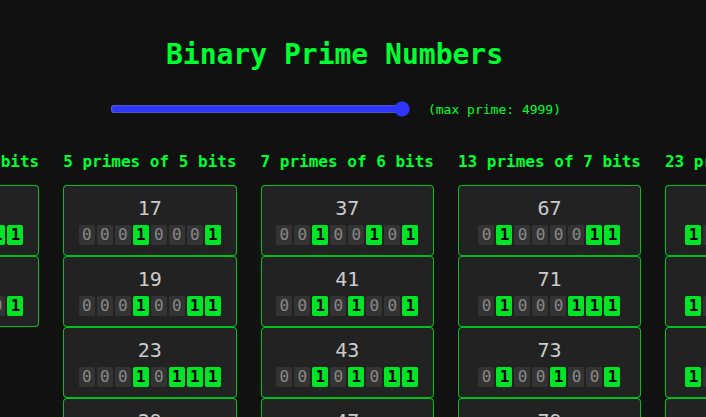

# Prime Binary Display

An interactive visualization of prime numbers represented in binary form.

Prime numbers are generated up to a configurable limit and grouped by their binary length (number of bits).  
Each prime is displayed as a block of binary digits for visual inspection.

**Live demo:** https://codepen.io/guillhermm/pen/YPWqbvb

## How it works

- Prime numbers are generated using the Sieve of Eratosthenes.
- Generated primes are cached to avoid unnecessary recomputation.
- A range slider controls the upper limit of generated primes.
- Slider input is debounced to prevent excessive re-rendering.
- Rendering uses `DocumentFragment` for improved performance.

## Notes

This project prioritizes clarity and visual structure.  
It is intended as an exploratory UI experiment rather than a performance benchmark.
